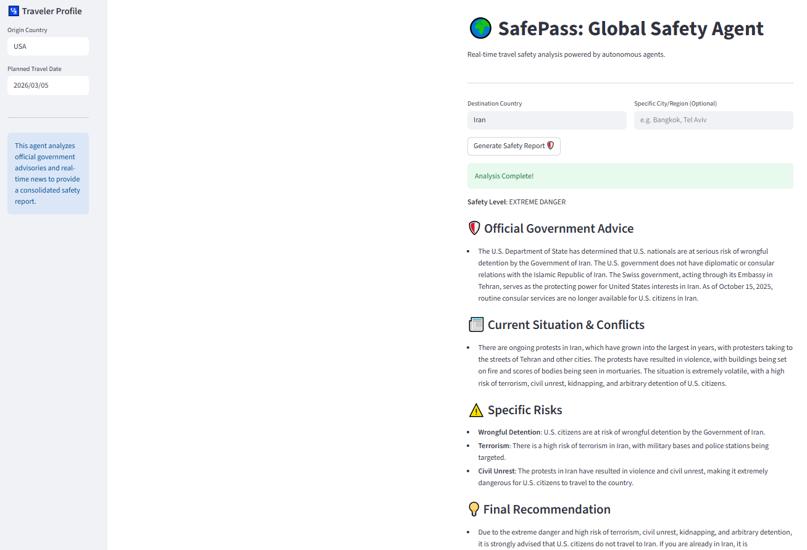

# 🌍 SafePass: Global Safety Agent



SafePass is an autonomous AI Agent built with Streamlit that provides real-time, context-aware travel safety reports. By utilizing advanced OSINT (Open Source Intelligence) techniques, it analyzes official government advisories and current global news to generate professional risk assessments.

## 🚀 Overview

Unlike standard language models that rely on outdated training data, SafePass operates as a **ReAct Agent**. It autonomously:

1. **Conducts Context-Aware OSINT:** Formulates targeted search queries in the native language of the user's origin country to extract official travel warnings from specific foreign ministries (e.g., MSZ in Poland, FCDO in the UK, State Department in the US).

2. **Monitors Real-Time Conflicts:** Scrapes the latest news articles for ongoing protests, military actions, or safety hazards in the destination country.

3. **Synthesizes Intelligence:** Processes the raw data to output a structured, professional safety report with a clear danger level and specific risk factors.

## 🛠️ Technology Stack

* **Frontend & App Framework:** Streamlit
* **AI Engine:** Groq (Llama 3.3 70B Versatile)
* **Agentic Search / Web Scraping:** Tavily API
* **Language:** Python 3.9+
* **Deployment:** Hugging Face Spaces (Docker)

## ⚙️ Key Features

* **ReAct Architecture:** The agent determines its own search strategies, evaluates the results, and decides if it needs to adjust its queries before generating the final report.
* **Tavily Integration:** Bypasses standard search engine limitations by utilizing an AI-first search API that deeply scrapes and extracts clean content from official government portals.
* **Native Tool Calling:** Strictly utilizes JSON-based tool calling to eliminate "JSON leaks" and hallucinations.
* **Dynamic Geopolitics:** Adapts its advice based on the diplomatic relations and official stances of the user's specific home country.

## 💻 Local Setup

To run this AI Agent locally on your machine:

1. Clone the repository:
   ```bash
   git clone [https://github.com/YourUsername/SafePass.git](https://github.com/YourUsername/SafePass.git)
   cd SafePass
   ```

2. Install the required dependencies:
   ```bash
   pip install -r requirements.txt
   ```

3. Set your API keys as environmental variables. You will need keys from [Groq](https://console.groq.com/) and [Tavily](https://tavily.com/):
   ```bash
   # On macOS/Linux
   export GROQ_KEY='your_groq_api_key_here'
   export TAVILY_KEY='your_tavily_api_key_here'
   
   # On Windows (Command Prompt)
   set GROQ_KEY=your_groq_api_key_here
   set TAVILY_KEY=your_tavily_api_key_here
   ```

4. Run the Streamlit application:
   ```bash
   streamlit run streamlit_app.py
   ```

## ⚠️ Disclaimer

*This tool provides autonomous AI-generated summaries based on web data. It is not a substitute for official government guidance. Always verify with official government sources and embassies before making travel decisions.*